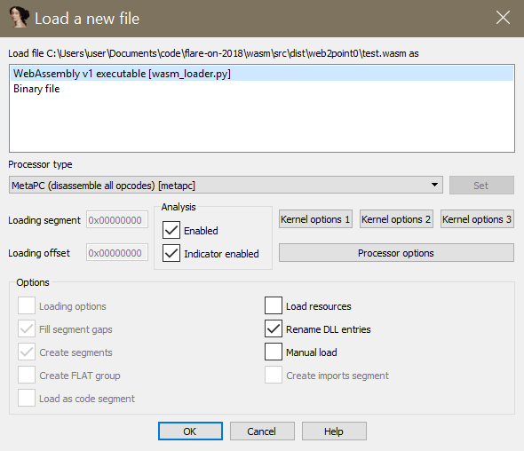
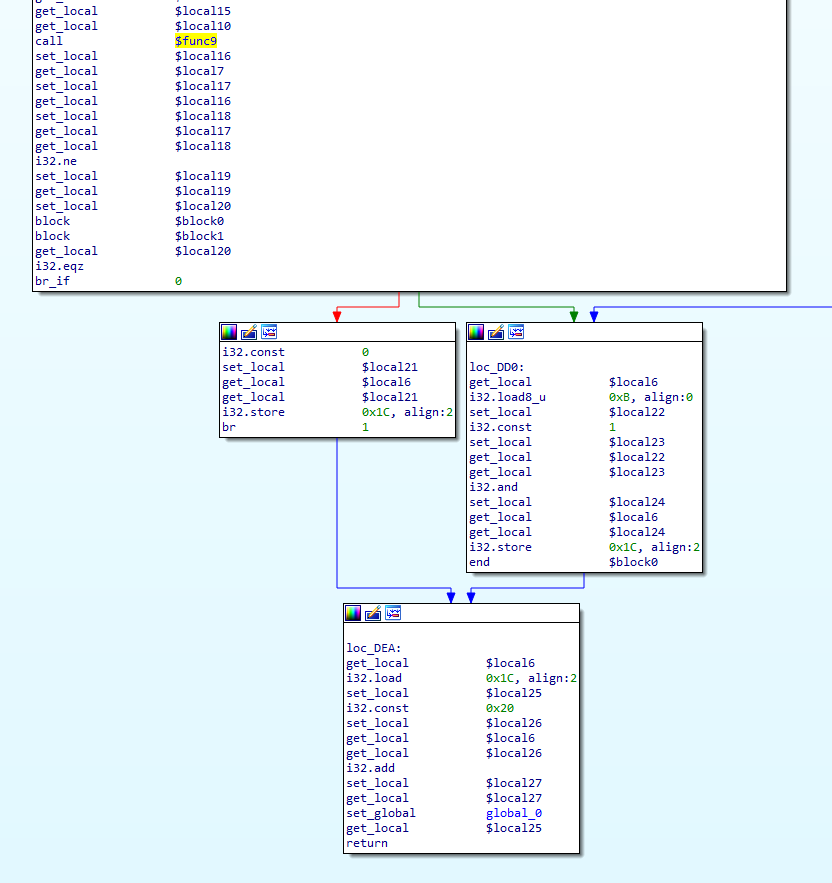
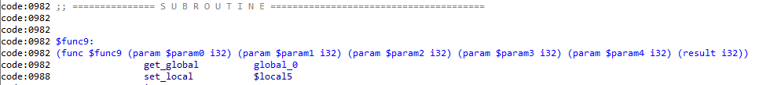
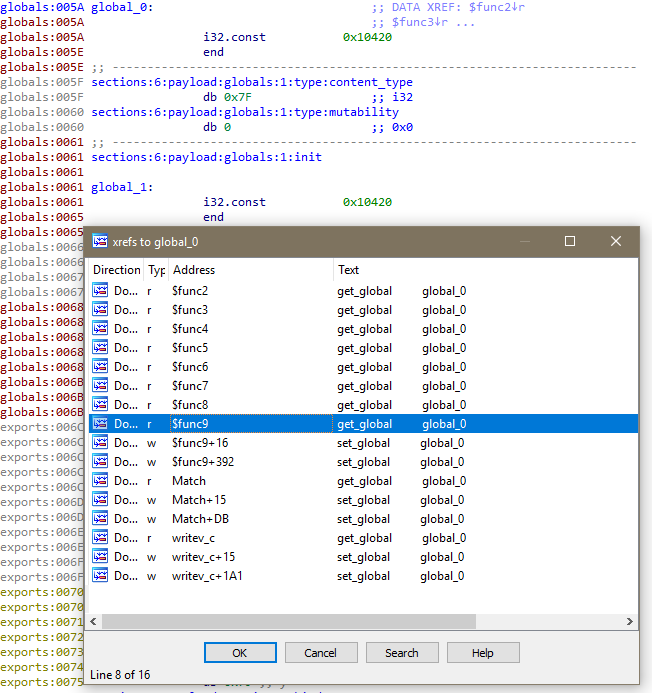

# idawasm

These IDA Pro plugins add support for loading and disassembling WebAssembly modules.


Features:

  - control flow reconstruction and graph mode
  - code and data cross references
  - globals, function parameters, local variables, etc. can be renamed
  - auto-comment hint suport
  
  
#### recognizes WebAssembly modules




#### reconstructs control flow



#### parses and renders types



#### extracts code and data cross references



  
## installation

There are three steps to install this loader and processor:

1. install the python module:
  
```
    python.exe setup.py install
```

2. manually install the WebAssembly file loader:
    
```
    mv loaders\webassembly.py %IDADIR%\loaders\webassembly.py
```

3. manually install the WebAssembly processor:
    
```
    mv procs\webassembly.py %IDADIR%\procs\webassembly.py
```

Whenever you update this project, you'll need to update the python module, but shouldn't have to touch the loader and processor files.


## acknowledgements

This project relies on the [athre0z/wasm](https://github.com/athre0z/wasm) WebAssembly decoder and disassembler library for Python.
